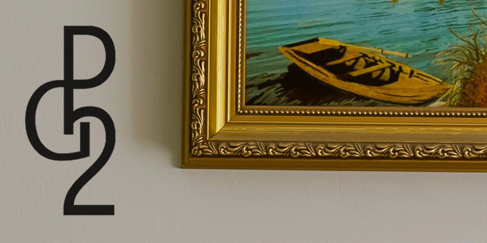
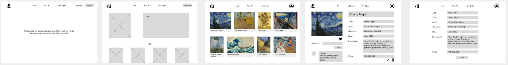
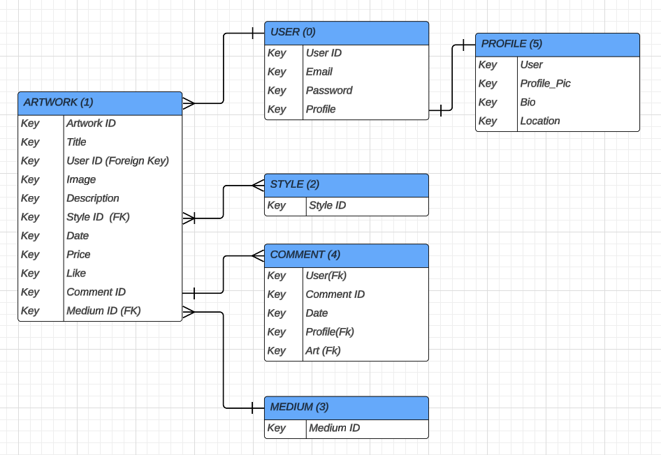
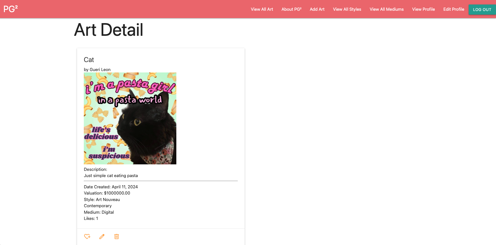
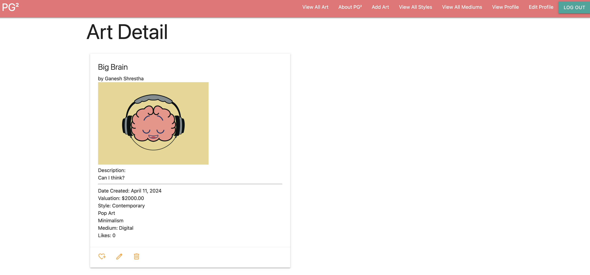
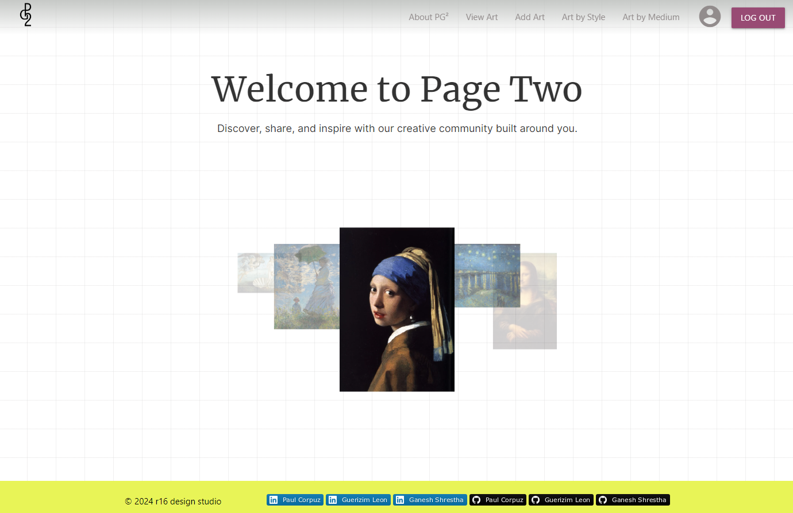

🎨 PG²: Page Two
============
We are more than a digital art gallery - we are the world's best community for artists of all skill levels to share, discover, and engage.

### What sets up apart
- **Creativity**: Our platform is for art of all mediums and styles. Page Two encourages artists to experiment, innovate, and share their unique perspectives with the world.
- **Diversity**: Whether you're a seasoned professional or just starting out, Page Two welcomes artists of all backgrounds, styles, and skill levels.
- **Community**: Users are able to leave comments, feedback, and likes to show support to our community.

### Join the community
Whether you're here to showcase your latest masterpiece, connect with fellow artists, or simply find inspiration, We invite you to join us on our creative journey. 

### [See you on Page Two!](https://page-two-33130444ddaf.herokuapp.com/)

👩🏻‍🎨👨🏽‍🎨👨🏽‍🎨 Meet the Team: R16
============
The name 'R16' was inspired by the Zoom Room where our group was founded. At the heart (and the code!) of Page Two is a collective of programmers united by their shared passion for art and technology.

This project is brought to you by Paul Corpuz, Guerizim Leon, and Ganesh Shrestha:

**Paul Corpuz:**

**Guerizim Leon:**

**Ganesh Shrestha:**

📝 App Overview
============
Page Two is developed using Python, Django, and PostgreSQL featuring Django Authentication and Materialize CSS.

💻 Technologies Used
==============

📸 Screenshots
==============
### Wireframe

### ERD

### Mid-Development

### Deployed

🔧 Getting Started 
============
### Prerequisites
- Ensure you have a modern web browser installed on your device, such as Google Chrome, Firefox, Safari, or Edge.
- To access full CRUD capabilities, please be sure to sign up/log in to Page Two.

### Installation
No installation required, however, internet access is necessary.

⏭️ Next Steps
============
- [X] Optimize for mobile screens.
- [ ] Update Models to include more attributes.
- [ ] Ability to search database for art, or by artist.
- [ ] Ability to share on other social media platforms.
- [ ] Connect to Cloud storage (like AWS S3) to store content.
- [ ] Ability to incorporate audio/video content.

❤️ Acknowledgments
============
Special thank you to Seanna Arnold, Natalia Parra, Eric Klimowich, Lisa Young, and Spirit Barnes for contributing art to our project!